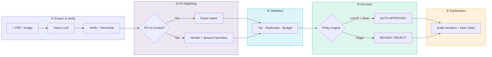
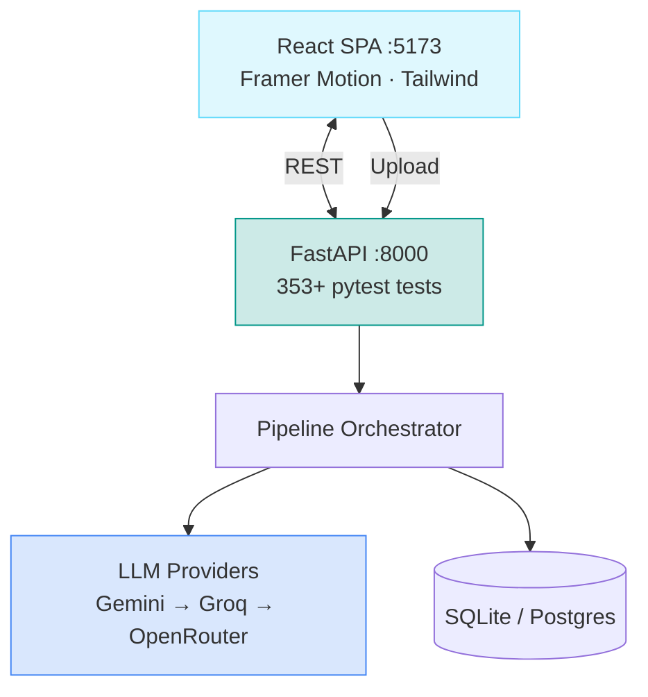

<div align="center">

<!-- 3D-style animated header -->


<!-- Typing animation -->


<br/>

[](https://www.python.org/)
[](https://fastapi.tiangolo.com/)
[](https://react.dev/)
[](https://www.typescriptlang.org/)
[](https://www.sqlite.org/)
[](https://ai.google.dev/)

<br/>

**Intelligent accounts-payable pipeline — extract, match, validate, decide, explain.**

[Quick Start](#-quick-start) · [Pipeline](#-the-5-stage-pipeline) · [Demo](#-demo-scenarios) · [API](#-api) · [Tests](#-tests)

</div>

---

## ✨ What it does

InvoiceFlow AI turns **messy invoice PDFs and phone photos** into a structured **pay / don't pay / needs review** decision with a full audit trail.

| You upload | The system returns |
|------------|-------------------|
| Crumpled scan, no PO on page | Ranked PO suggestions + human confirm |
| Clean invoice with PO number | Auto-match → validate → auto-approve (when policy allows) |
| Duplicate or tax mismatch | Block with specific reason codes |
| CSV master data | Unified PO + vendor mirror for matching |

Built for **PS-1 / Zamp-style AP automation**: deterministic rules where it matters, vision LLMs where humans used to squint at pixels.

---

## 🎬 The 5-stage pipeline



<details>
<summary><b>Stage breakdown (click to expand)</b></summary>

| Stage | Name | What happens |
|-------|------|----------------|
| **1** | Extract & Verify | Gemini / Groq / OpenRouter vision models read the document; second LLM pass challenges extraction; arithmetic reconciliation |
| **2** | PO Matching | Candidate discovery, evidence scoring (vendor, lines, amount, balance), ambiguity detection, human confirm when uncertain |
| **3** | Validation | Tax, duplicates, vendor checks, receipt/budget tolerance, fraud signals |
| **4** | Business Decision | Hard controls → policy → authority → routing (auto-approve limits) |
| **5** | Explanation | Immutable narrative, rule trace, upstream artifact hashes, audit ledger |

</details>

---

## 🏗 Architecture



---

## 🚀 Quick start

### Prerequisites

- **Python 3.11+**
- **Node.js 20+**
- At least one LLM API key (**Gemini** recommended)

### 1 · Backend

```bash
git clone https://github.com/keshav-077/zamp-Invoice-processing-from-PDF-to-decision.git
cd zamp-Invoice-processing-from-PDF-to-decision

pip install -r requirements.txt
cp .env.example .env
# Add GEMINI_API_KEY (and optional GROQ / OPENROUTER fallbacks)

uvicorn app.main:app --reload --port 8000
```

Open **http://localhost:8000/docs** for interactive API docs.

### 2 · Frontend

```bash
cd frontend
cp .env.example .env
npm install
npm run dev
```

Open **http://localhost:5173**

### 3 · Seed demo PO data (optional)

```bash
python scripts/build_po_xlsx.py
python scripts/reset_db.py
python scripts/verify_demo_matrix.py --offline
```

---

## 🎯 Demo scenarios

See [`DEMO_MATRIX.md`](DEMO_MATRIX.md) for the full matrix.

| Scenario | Example | Expected |
|----------|---------|----------|
| Happy path | Invoice with PO on page | Auto-match → AUTO_APPROVED |
| Crumpled scan | Rogers / Harrington demos | Vendor + amount match without printed PO |
| Ambiguous | No PO, two similar open POs | Human picks candidate |
| Split PO | Second bill on consumed PO | Suggestion + overbilling warning |
| Non-PO | Restaurant receipt | Limited validation path |

Reset everything for a clean demo:

```bash
python scripts/reset_demo_environment.py
```

---

## 📁 Project structure

```
invoiceflow-ai/
├── app/
│   ├── api/              # FastAPI routes
│   ├── pipeline/         # Stages 1–5 orchestrators
│   ├── providers/        # Gemini, Groq, OpenRouter adapters
│   └── services/         # Import, review, rerun
├── frontend/             # React + Vite + Tailwind UI
├── config/               # matching_policy.yaml, validation_policy.yaml
├── scripts/              # Demo reset, PO seed, diagnostics
├── tests/                # 350+ automated tests
└── docs/                 # Glossary & pipeline status docs
```

---

## 🔌 API

| Method | Path | Description |
|--------|------|-------------|
| `POST` | `/api/upload/async` | Upload invoice (background job) |
| `GET` | `/api/jobs/{id}` | Poll processing status |
| `GET` | `/api/invoices/{id}` | Full pipeline result + audit |
| `GET` | `/api/invoices/{id}/original` | Download source file |
| `POST` | `/api/reviews/{id}/actions` | Confirm PO / correct fields |
| `GET` | `/api/health` | Provider connectivity |

---

## 🧠 LLM provider chain

Configured in `.env` — tries providers in order with automatic fallback on overload:

```
PROVIDER_PRIORITY=gemini,groq,openrouter
```

| Provider | Role |
|----------|------|
| **Gemini** | Primary vision extraction (best for images) |
| **Groq** | Fast fallback (watch payload size on free tier) |
| **OpenRouter** | Secondary fallback |

---

## 🧪 Tests

```bash
pytest tests/ -q
```

---

## 🛡 Security notes

- **Never commit `.env`** — API keys stay local (see `.gitignore`)
- Upload directory and SQLite DB are gitignored
- Production can use Neon Postgres + Vercel (see existing deploy section in repo docs)

---

## 📜 License & attribution

Built as an intelligent invoice processing demo — **PDF/image → structured extraction → PO match → validation → pay/reject decision** with human-in-the-loop when confidence is insufficient.

---

<div align="center">


**⭐ Star this repo if it helped you automate invoice processing**

</div>
